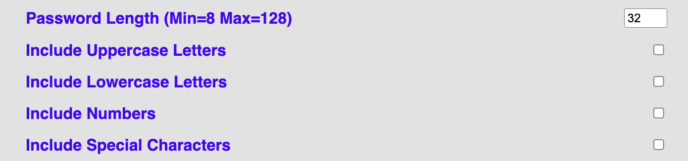
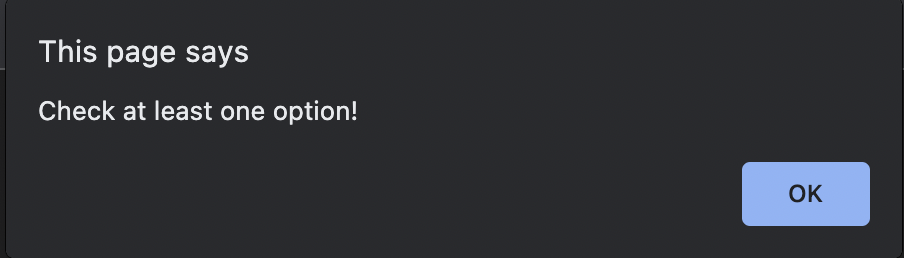
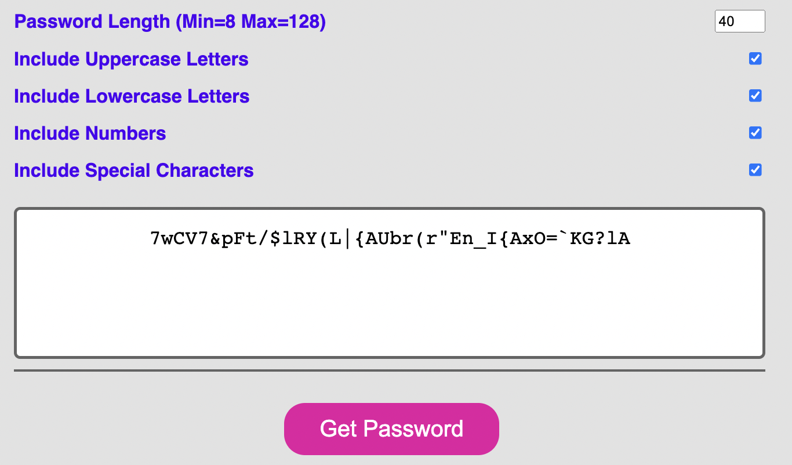
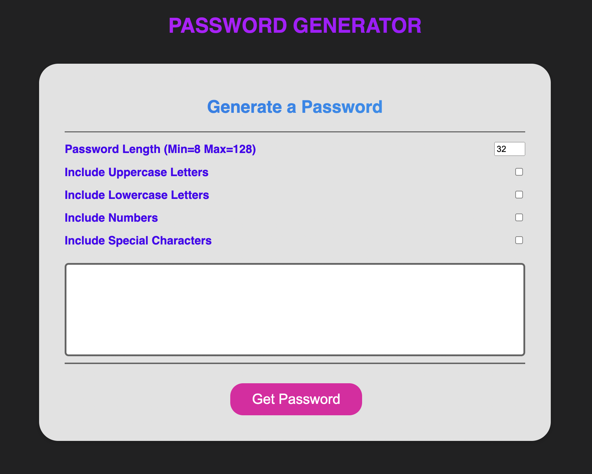

# **Adrian Strozzi - Password Generator**

## Description

> Welcome to the Password Generator! This is an application which generates random passwords according to the selected parameters. You can define the length and the option to include/exclude: Lowercase letters, Uppercase Letters, Numbers & Special Characters.

## How to use

Use this **link** to access the Password Generator: [Adrian Strozzi - Password Generator](https://adrianstrozzi.github.io/Tec03PasswordGenerator/)

## Usage

Define the **password parameters** by using the input box and checkboxes:  

Please note that an **Alert** will show if at least one checkbox is not selected:

Once parameter(s) is/are chosen click on the **Get Password Button** to get your password:

You will see your **Generated Password** in the box below:

Below is an image of the complete **App**:

## Credits

**Adrian Strozzi:** [https://github.com/adrianstrozzi](https://github.com/adrianstrozzi)

## License

**© 2021 Adrian Strozzi**
